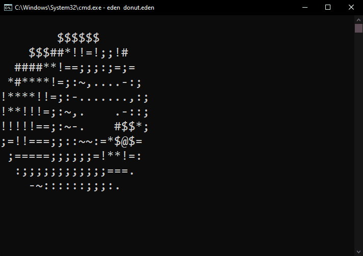

# 🍩 Spinning ASCII Donut in Eden

Showcase of **spinning ASCII donut** animation implemented in [Eden](https://github.com/EdenLanguage/Eden), my custom programming language. I wanted to prove that you can actually build something in Eden - and classic ASCII donut felt just right.

## 🎥 Demo



> ⚠️ Due to the performance of Eden language, generating frames may take some time. The animation might run slower depending on your system.

## 🚀 How to Run

To run the demo, you'll need to have [Eden](https://github.com/EdenLanguage/Eden) installed on your local machine.

Once it's installed:
1. Clone this repository:  
```bash
git clone https://github.com/EdenLanguage/SpinningDonut
```
2. Navigate to folder:
```bash
cd SpinningDonut
```
3. Run program:
```bash
eden main.eden
```
4. Enjoy 😉

## 🔬 Resources
- [**Eden**](https://github.com/EdenLanguage/Eden) by Darek Krawczyk
- [**Donut Math**](https://www.a1k0n.net/2011/07/20/donut-math.html) by Aik0n
- [**3D Donut in C**](https://github.com/akhileshthite/3d-donut) by akhileshthite 
- [**How to Create a Spinning Donut**](https://www.youtube.com/watch?v=LqQ-ezbyiW4&ab_channel=GiovanniCode) by GiovanniCode
- [**Spinning Donut in Console**](https://www.youtube.com/watch?v=DEqXNfs_HhY&ab_channel=LexFridman) by Lex Fridman
- [**3D Donut Console Project**](https://www.youtube.com/watch?v=74FJ8TTMM5E&ab_channel=GreenCode) by GreenCode